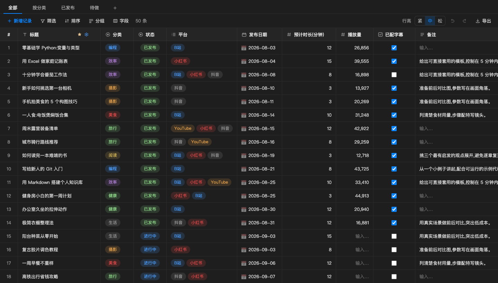
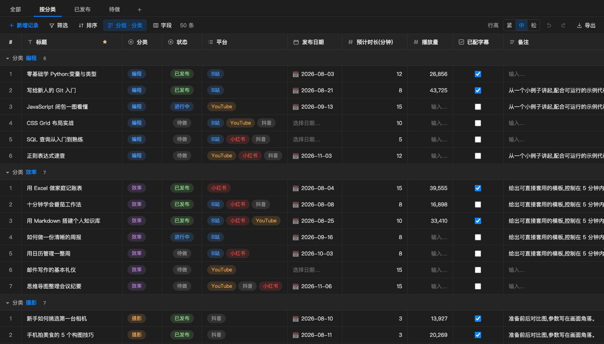
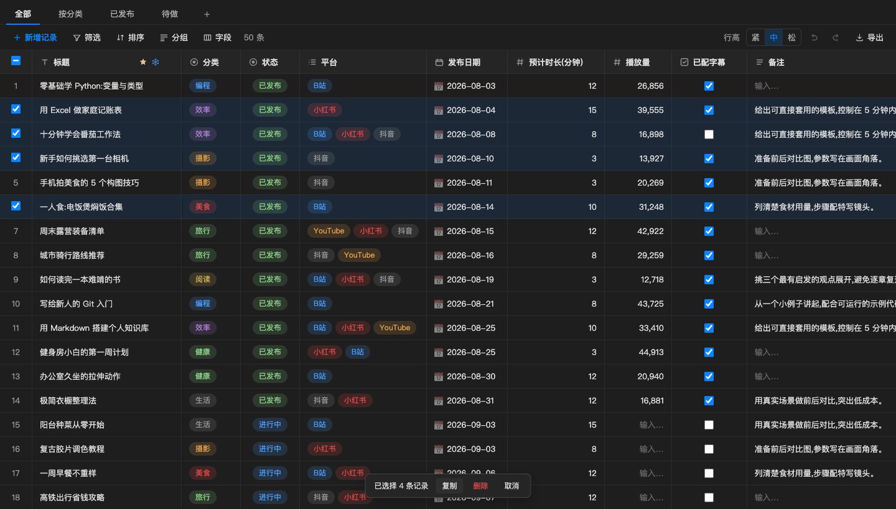

<div align="right">
  <details>
    <summary>🌐 Language</summary>
    <div>
      <div align="right">
        <p><a href="./README.md">English</a></p>
        <p><a href="./README.zh-CN.md">简体中文</a></p>
      </div>
    </div>
  </details>
</div>

<h1 align="center">
  <a href="https://github.com/Azure12355/weilanx-base-table/releases">
    <br>
  </a>
</h1>

<p align="center"><a href="./README.md">English</a> | 中文 | <a href="https://azure12355.github.io/weilanx-base-table/">官网</a> | <a href="#-让-ai-agent-帮你安装">Agent 安装</a> | <a href="#-快速开始">快速开始</a> | <a href="#-文件格式">文件格式</a> | <a href="#-开发">开发</a> | <a href="https://github.com/Azure12355/weilanx-base-table/issues">反馈</a><br></p>

<div align="center">

[![][vscode-shield]][vscode-link]
[![][typescript-shield]][typescript-link]
[![][react-shield]][react-link]
[![][i18n-shield]][i18n-link]

</div>
<div align="center">

[![][release-shield]][release-link]
[![][stars-shield]][stars-link]
[![][issues-shield]][issues-link]
[![][license-shield]][license-link]
[![][pr-shield]][pr-link]

</div>

# 📊 Weilanx 多维表格

Weilanx 多维表格(Weilanx Base Table)是一个 VS Code 插件,把一个 `.base` 文件变成**多维表格**(类似飞书多维表格 / Airtable):多视图、筛选、排序、分组、内联编辑,全部在编辑器里完成。

`.base` 文件本质是**纯 JSON**:字段、视图、记录都在一个结构化文档里。对人来说是一张好用的表格;对 AI Agent 来说,`JSON.parse` 一次就能读全,几行代码就能改。

❤️ 觉得好用?点个 Star 🌟 支持一下!

# 🌠 界面截图







# 🌟 核心功能

1. **视图**:

- 🗂 一张表多个视图:新建、复制、重命名、删除,标签可拖拽排序
- 🔍 多条件筛选(且 / 或),16 种比较方式
- ↕️ 多字段排序
- 📁 按任意字段分组,分组可折叠
- ❄️ 冻结列,行高可调(紧凑 / 中等 / 宽松)

2. **字段**:

- 🔤 8 种字段类型:文本、长文本、单选、多选、日期、数字、复选框、链接
- 🎨 彩色选项标签,自动跟随 VS Code 主题配色
- 📅 5 种日期格式;数字支持数值 / 百分比 / 货币、小数位和千分位
- ↔️ 列宽拖拽、列拖拽换位、隐藏、复制字段、对齐方式,统一在字段面板里管理

3. **编辑**:

- ✏️ 内联编辑 + 乐观更新,不闪烁,改完立即保存到文件
- ☑️ 悬停行号出现复选框,Shift 连选,表头一键全选
- 📋 `Cmd/Ctrl+C` 复制选中记录(TSV + HTML),粘贴到 Excel、飞书、WPS 自动分格
- ↩️ 撤销 / 重做(`Cmd/Ctrl+Z`、`Cmd/Ctrl+Shift+Z`、`Ctrl+Y`),批量删除一次撤销全部恢复
- 🖱 拖拽行调整顺序,点击被截断的单元格展开完整内容

4. **VS Code 集成**:

- 📂 侧边栏专属目录树,列出工作区内所有 `.base` 文件
- ⌨️ 快捷键都是 VS Code 原生快捷键,可在「键盘快捷方式」里改键
- 🌐 中英文界面,跟随 VS Code 显示语言自动切换
- 📤 导出为 CSV、Excel(`.xls`)或完整 JSON
- 🎨 自定义文件图标(兼容 Material Icon Theme)

5. **对 Agent 友好**:

- 🤖 单文件 JSON,每条记录有稳定 `id`,AI Agent 读写零门槛
- 🔄 文件被外部修改时,打开的表格实时刷新

# 🤖 让 AI Agent 帮你安装

现在大多数人都让 Agent 代劳。把下面这段话粘贴给 **Claude Code**、**Codex**、**Cursor** 或任何能用终端的 Agent:

```text
帮我安装 Weilanx Base Table 这个 VS Code 插件。
按照 https://github.com/Azure12355/weilanx-base-table/blob/main/docs/install-for-agents.md 操作,
装完确认 "code --list-extensions" 里有 weilanx.weilanx-base-table。
```

也可以自己运行安装脚本(macOS / Linux)。它会自动找到 VS Code、Cursor、Windsurf、Insiders,逐个安装并校验:

```bash
curl -fsSL https://raw.githubusercontent.com/Azure12355/weilanx-base-table/main/scripts/install.sh | bash
```

> 只想装到某一个编辑器?在 `bash` 前加上 `BT_EDITOR=cursor`。写给 Agent 的完整步骤、校验和排错见 [`docs/install-for-agents.md`](./docs/install-for-agents.md)。

# 🚀 快速开始

1. 从最新 Release 下载 [`weilanx-base-table.vsix`](https://github.com/Azure12355/weilanx-base-table/releases/latest/download/weilanx-base-table.vsix),或者自己打包(见 [开发](#-开发))。
2. VS Code:扩展面板 → `···` → **从 VSIX 安装...**,或运行 `code --install-extension weilanx-base-table.vsix --force`
3. 打开任意 `.base` 文件(可以先试试 [`examples/选题库.base`](./examples/选题库.base)),或在命令面板运行 **多维表格: 创建多维表格 (.base)**。

# 📄 文件格式

一个 `.base` 文件就是这样一份 JSON:

```json
{
  "fields": {
    "标题":   { "type": "text", "primary": true },
    "状态":   { "type": "select", "options": ["待做", "进行中", "已发布"],
               "colors": { "待做": "gray", "进行中": "blue", "已发布": "green" } },
    "平台":   { "type": "multi",  "options": ["B站", "小红书", "抖音", "YouTube"] },
    "发布日期": { "type": "date" },
    "备注":   { "type": "longtext" }
  },
  "views": [
    { "name": "全部" },
    { "name": "待做",   "filters": [{ "field": "状态", "op": "is", "value": "待做" }] },
    { "name": "已发布", "filters": [{ "field": "状态", "op": "is", "value": "已发布" }],
      "sorts": [{ "field": "发布日期", "dir": "desc" }] }
  ],
  "records": [
    { "id": "r_001", "标题": "零基础学 Python", "状态": "已发布",
      "平台": ["B站", "小红书"], "发布日期": "2026-08-03", "备注": "从一个小例子讲起。" }
  ]
}
```

- **字段类型**:`text` · `longtext` · `select` · `multi` · `date` · `number` · `checkbox` · `link`
- **记录**带稳定的 `id`(主字段的值会变、可能重复,不能当标识);其余键就是字段值,空值不写入
- **主字段**(`primary: true`)是普通字段,只是标记为标题列,不能删除
- **筛选 `op`**:`is` `isNot` `contains` `notContains` `empty` `notEmpty` `before` `after` `eq` `ne` `gt` `lt` `gte` `lte` `checked` `unchecked`
- **排序 `dir`**:`asc` / `desc`

# ⚙️ 设置项

| 设置 | 默认值 | 说明 |
| --- | --- | --- |
| `baseTable.rowHeight` | `medium` | 默认行高:`compact` / `medium` / `tall` |
| `baseTable.showRowNumbers` | `true` | 显示左侧行号列 |
| `baseTable.fontSize` | `0` | 单元格字号(px),`0` 跟随编辑器 |
| `baseTable.colorfulTags` | `true` | 单选 / 多选用彩色标签 |
| `baseTable.wrapText` | `false` | 单元格文字换行(关闭则单行省略) |

# 🔧 开发

```bash
npm install
npm run build        # 打包 webview(vite) + 扩展(esbuild)
npm test             # 数据层单测
npm run typecheck

npm run package            # 构建并生成 weilanx-base-table.vsix
```

在 VS Code 里按 **F5** 启动「扩展开发宿主」,然后打开 `examples/选题库.base`。

# 📝 路线图

- 🗃 看板、日历、画廊视图
- 🔗 多表关联
- 🧮 公式字段
- 🌐 表格内部界面(工具栏、面板)英文化

# 🤝 参与贡献

欢迎提 Issue 和 Pull Request!提交 PR 前请先跑通 `npm test` 和 `npm run typecheck`。

# 📜 开源协议

[MIT](./LICENSE) © Azure12355

<!-- badges -->
[vscode-shield]: https://img.shields.io/badge/VS%20Code-%5E1.90-007ACC?logo=visualstudiocode&logoColor=white
[vscode-link]: https://code.visualstudio.com/
[typescript-shield]: https://img.shields.io/badge/TypeScript-5-3178C6?logo=typescript&logoColor=white
[typescript-link]: https://www.typescriptlang.org/
[react-shield]: https://img.shields.io/badge/React-19-61DAFB?logo=react&logoColor=black
[react-link]: https://react.dev/
[i18n-shield]: https://img.shields.io/badge/i18n-English%20%7C%20中文-0088CC
[i18n-link]: ./README.md
[release-shield]: https://img.shields.io/github/v/release/Azure12355/weilanx-base-table?logo=github
[release-link]: https://github.com/Azure12355/weilanx-base-table/releases
[stars-shield]: https://img.shields.io/github/stars/Azure12355/weilanx-base-table?logo=github
[stars-link]: https://github.com/Azure12355/weilanx-base-table/stargazers
[issues-shield]: https://img.shields.io/github/issues/Azure12355/weilanx-base-table?logo=github
[issues-link]: https://github.com/Azure12355/weilanx-base-table/issues
[license-shield]: https://img.shields.io/badge/License-MIT-green.svg
[license-link]: ./LICENSE
[pr-shield]: https://img.shields.io/badge/PRs-welcome-FF6699.svg
[pr-link]: https://github.com/Azure12355/weilanx-base-table/pulls
